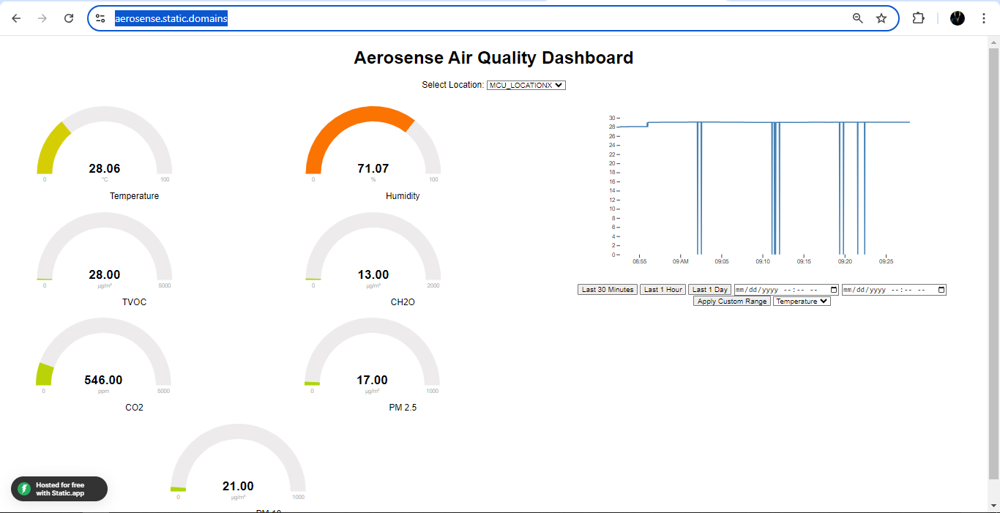
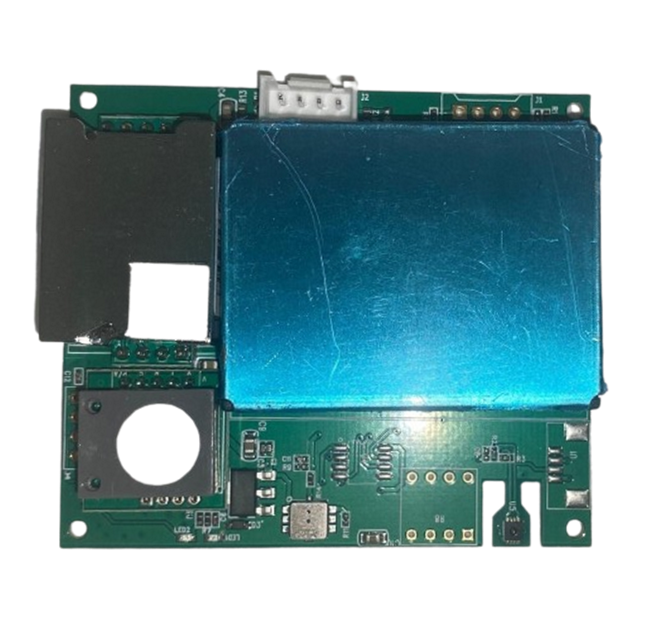

# Aerosense Air Quality Monitoring System

Aerosense is an IoT project designed to monitor air quality in real-time using a unified sensor board (M701B-UART) that measures multiple air quality metrics. The data collected from the sensor is sent to a Supabase database via an ESP32 microcontroller and visualized using a custom dashboard.

## Project Overview

### Features
- **Real-time Monitoring**: Continuously tracks various air quality metrics.
- **Unified Sensor**: Utilizes the M701B-UART sensor to measure temperature, humidity, CO2, CH2O, TVOC, PM2.5, and PM10.
- **Data Storage**: Stores collected data in a Supabase database.
- **Custom Dashboard**: Visualizes the data using a custom-built web dashboard for comprehensive analysis.

### Components
- **ESP32 Microcontroller**: Connects to the M701B-UART sensor and sends data to the Supabase database.
- **M701B-UART Sensor**: Measures multiple air quality parameters.
- **Supabase**: Acts as the backend database for storing the sensor data.
- **Custom Dashboard**: Provides real-time data visualization through a web interface.

## Project Directory Structure
- **index.html**: Contains the code for the web version of the custom dashboard.
- **supabase_m701.ino**: Contains the code for interfacing with the M701B-UART sensor and sending data to Supabase.

## Images

## Usage
1. **Hardware Setup**: Connect the M701B-UART sensor to the ESP32 microcontroller.
2. **Firmware**: Upload the `supabase_m701.ino` code to the ESP32.
3. **Web Dashboard**: Open `index.html` to view the real-time data visualization on the custom dashboard.

## Contributing
Contributions are welcome! Please remove any sensitive information such as API keys before pushing changes to the repository.

## License
This project is licensed under the MIT License.

## CONTACT
Contact the project team via mail: finalproject2024aug@gmail.com
